# ARCHITECTURE.md — Design Review & System Design for "Wren"

> Derived from a full read of `PROMPT.md`. This document contains **no implementation code** — only analysis, structure, schema, contracts, and sequencing. Code generation starts only after you sign off on this.

---

## PART A — Specification Analysis

### A.1 Missing Requirements

| # | Gap | Why it matters |
|---|---|---|
| 1 | **Post ID generation strategy is undefined.** `PROMPT.md` says IDs look like `p1, p2...` but never specifies how they're generated concurrently-safely. | If two ticks (different agents, or a retried tick) compute `COUNT(*)+1` independently, you get duplicate IDs — a direct spec violation ("unique id"). |
| 2 | **No behavior defined for a second `POST /agent/init` call.** Spec says the evaluator calls it "exactly once," but doesn't say what your system should do if it's called twice (network retry, evaluator error, your own testing against the live deploy). | Failing to define this risks either an unhandled 500 or accidentally resetting/duplicating agent state during evaluation. |
| 3 | **`persona` field from the init request is accepted but never actually used.** The spec hardcodes Wren's full voice/interest bible (Section 2) regardless of what `persona.name` / `persona.domain` the evaluator sends in `POST /agent/init`. | This is a real API-contract gap — see **A.4 API Mismatches** below. |
| 4 | **No tie-breaking rule** when two candidates in the same tick get equal editorial scores. | Undefined behavior = non-deterministic demo behavior judges could catch by asking "why this one, not that one" when scores are equal. |
| 5 | **No bound on the self-critique → fallback-candidate retry loop** (Section 7.9's "fall back to the next-highest-scoring candidate"). | Without a max-retry cap, a bad tick (e.g., persona-drifting candidates) could loop through every candidate and burn LLM calls/latency, or in a bug scenario, loop indefinitely. |
| 6 | **No malformed-JSON recovery path.** Every LLM call in the pipeline demands strict structured JSON, but LLMs occasionally wrap output in prose or markdown fences even when instructed not to. | Treating a JSON parse failure identically to a provider outage triggers unnecessary provider failover instead of a cheap "ask again for valid JSON" retry. |
| 7 | **Empty-tick behavior isn't stated explicitly.** What happens when everything discovered this tick is rejected? | Should be explicitly "no post this tick, metrics row still written" — worth stating so it isn't mistaken for a bug during your own testing. |
| 8 | **Broken internal cross-reference:** Section 7.7 references "Section 6.3" for tick pacing, but Section 6 is a flat numbered list, not subsectioned — there is no 6.3. | Minor, but exactly the kind of inconsistency that looks sloppy if a judge reads the spec alongside the code. |

### A.2 Technical Risks

| # | Risk | Detail |
|---|---|---|
| 1 | **Render free-tier sleep defeats the entire autonomy model, not just latency.** | A `@Scheduled` background thread only runs while the JVM process is alive. On Render's free tier, the whole dyno (not just HTTP handling) suspends after ~15 min of no inbound HTTP traffic — the scheduler stops too. Keep-alive pings mitigate this only as long as they're never missed; a single dropped keep-alive ping (cron provider hiccup, transient network blip) can put the app to sleep, and it will miss however many ticks would have fired until the next inbound request wakes it. This is the single biggest risk to the "publishes over time with zero further input" requirement. |
| 2 | **Free-tier LLM rate limits across a 48-hour run.** | Each tick can trigger up to 3 LLM calls (judge, write, critique) plus possible retries/fallbacks. At ~1 post/tick and ~25–35 ticks over 48h, that's realistically 60–150+ LLM calls. Free tiers (especially Groq, OpenRouter free models) have daily/rate caps that can be hit well before 48 hours are up — this is exactly what the provider fallback chain is *for*, but it needs all 4 providers actually configured, not just designed. |
| 3 | **NVD CVE API without an API key is heavily rate-limited** (5 requests/30s unauthenticated vs. 50/30s with a free key), and free key approval isn't always instant. | Apply for the NVD API key on day one, not when you get to building the adapter. |
| 4 | **Unauthenticated GitHub REST search is capped at 60 requests/hour**, shared across your whole app. | A GitHub personal access token (even without special scopes) raises this to 5,000/hour — trivial to get, but must be provisioned in advance. |
| 5 | **Postgres array columns (`sources TEXT[]`) don't map cleanly through default Spring Data JPA/Hibernate** without an explicit array type mapping. | This is a very common integration bug (silently fails or throws a mapping exception) — plan for it explicitly rather than discovering it mid-hackathon. |
| 6 | **`pgvector` isn't guaranteed pre-enabled on a fresh Supabase project** — it's an extension that must be explicitly turned on. | If you plan to use it (even as a stretch goal), verify/enable it early; don't assume it "just works" the day you get to that stretch goal. |
| 7 | **Multi-instance / redeploy race conditions.** | If Render ever briefly runs two instances during a deploy (blue/green), two schedulers could tick the same agent simultaneously, risking duplicate IDs or duplicate posts. Needs either a DB-level advisory lock or an application-level "claim this tick" pattern. |

### A.3 Scalability Concerns

These matter less for a 48-hour, single-agent hackathon demo, but are worth naming so you know what you're deliberately *not* building:

- **Single always-on JVM instance** is a deliberate simplicity choice (per `PROMPT.md` Section 3) — it will not horizontally scale past one instance without the locking fix in A.2 #7. Fine for this competition; would need a distributed scheduler (e.g., ShedLock, a real job queue) for a multi-agent production version.
- **In-process scheduler ties agent count to JVM thread pool size.** With one agent this is a non-issue; if you ever init multiple agents for your own testing against the same deployment, make sure the `ThreadPoolTaskScheduler` pool size is set explicitly (default is small) so ticks don't silently queue up and drift.
- **Memory retrieval (Section 8) is currently O(n) keyword/substring scan over `memory_entries`.** Fine at 20–30 posts over 48h; would need real indexing (embedding index, or at least a `topic_key` DB index) at higher volumes. Add the index anyway — it's free and correct practice.
- **No pagination on `GET /agent/feed`.** Not a problem at expected volume (tens of posts), explicitly out of scope for this spec — just don't let a demo/debug feature accidentally require it later.

### A.4 Deployment Issues

| # | Issue | Recommendation |
|---|---|---|
| 1 | Render free-tier sleep (see A.2 #1) directly threatens the core grading criterion (autonomous operation over ~48h). | Given the entire evaluation is about *not needing intervention*, this is worth the ~$7/mo for a Render paid instance (or an always-on alternative) for the evaluation window specifically, rather than betting the grade on keep-alive-cron reliability. |
| 2 | Supabase connection pooling (pgBouncer) + Hibernate prepared statements — already flagged in `PROMPT.md` with `prepareThreshold=0`, but HikariCP pool **size** also needs explicit tuning against Supabase's free-tier connection cap, or you risk connection exhaustion under concurrent request + scheduled-tick load. | Set `maximum-pool-size` explicitly (small, e.g. 5) rather than relying on HikariCP defaults sized for a bigger deployment. |
| 3 | Secrets management: 4 LLM provider keys + GitHub token + NVD key all need to live in Render's environment variable dashboard, not in source control. | Confirm `.env`/local secrets are git-ignored from commit #1 — an accidentally committed key is both a security and an authenticity-review red flag. |
| 4 | Cold-start latency after any sleep/redeploy could make the evaluator's *first* `GET /feed` call after a gap slow or timeout. | Worth confirming your host's cold-start time is comfortably under typical HTTP client timeouts (a few seconds, not 30+). |

### A.5 API Mismatches

| # | Mismatch | Recommendation |
|---|---|---|
| 1 | **The competition's `init` contract accepts an arbitrary `persona.name` / `persona.domain`, but the spec's implementation is a hardcoded persona ("Wren", fixed interest list).** If the evaluator's actual `init` call sends a different name/domain than expected, the returned feed will still behave as Wren under a different label — the *voice* and *interests* won't actually reflect whatever `domain` was passed in. | Decide and document one of two explicit strategies before building: **(a)** Freeze this — always operate as Wren regardless of init payload, and note in your README that persona is fixed for this submission (simplest, lowest-risk for a hackathon); or **(b)** Use the request's `persona.name` only as a display label substituted into the fixed Wren bible (cheap, keeps voice stable, satisfies "the response reflects what was sent"). Do **not** attempt to dynamically generate a whole new persona bible per arbitrary `domain` input live during evaluation — that reintroduces exactly the consistency risk the spec is trying to avoid. Recommendation: **(b)**. |
| 2 | Spec doesn't define an error contract for `GET /agent/feed` with a missing/unknown `agentId`. | Define explicitly (see Part D) rather than leaving it to whatever Spring's default exception handler produces. |
| 3 | Internal fields (`confidence`, `editorial_score`, `llm_provider_used`, `is_followup_of`) must never leak into the required feed response shape. | Use an explicit response DTO, never serialize the JPA entity directly — this is the easiest way to accidentally break the byte-for-byte required shape. |

---

## PART B — Complete Architecture

```
                         ┌───────────────────────────────────────┐
                         │        External Keep-Alive Cron         │
                         │  (cron-job.org → GET /health, ~10 min)  │
                         └────────────────────┬────────────────────┘
                                              │
┌─────────────────────────────────────────────┼─────────────────────────────────────────┐
│                        Render Web Service (single instance, Spring Boot)                │
│                                              ▼                                          │
│  ┌────────────────────────────────────────────────────────────────────────────────┐    │
│  │  API Layer (Controllers)                                                        │    │
│  │  POST /api/agent/init  GET /api/agent/feed  GET /health                        │    │
│  │  GET /api/agent/metrics (debug)  GET /api/agent/candidates (debug)             │    │
│  └───────────────────────────────┬──────────────────────────────────────────────┘    │
│                                   │                                                     │
│  ┌───────────────────────────────▼──────────────────────────────────────────────┐    │
│  │  Application Layer                                                            │    │
│  │  AgentService · FeedService · SchedulerRegistrar (resumes ACTIVE agents        │    │
│  │  from DB on boot, registers per-agent scheduled job, holds per-agent tick lock)│    │
│  └───────────────────────────────┬──────────────────────────────────────────────┘    │
│                                   │                                                     │
│  ┌───────────────────────────────▼──────────────────────────────────────────────┐    │
│  │  Pipeline Orchestrator (one PipelineRunner execution = one tick)              │    │
│  │  Discover → Normalize → Deduplicate → Credibility → Editorial Score →         │    │
│  │  Persona Alignment → Publish Decision → Write → Self-Critique → Memory Write  │    │
│  └───┬───────────────────────┬───────────────────────┬─────────────────────────┘    │
│      │                       │                       │                                │
│  ┌───▼──────────────┐  ┌─────▼───────────────┐  ┌────▼─────────────────────┐         │
│  │ Discovery Adapters│  │ LLM Provider Router  │  │ Memory / RAG Layer        │         │
│  │ ArxivAdapter       │  │ Gemini→Groq→          │  │ MemoryRetrievalService    │         │
│  │ HackerNewsAdapter  │  │ OpenRouter→Cerebras   │  │ MemoryWriteService        │         │
│  │ GithubAdapter       │  │ (failover + logging) │  │ (topic_key / embedding)   │         │
│  │ NvdAdapter          │  └───────────────────────┘  └────────────────────────┘         │
│  └────────────────────┘                                                                │
│                                                                                          │
│  ┌────────────────────────────────────────────────────────────────────────────────┐    │
│  │  Persistence Layer (Spring Data JPA repositories)                              │    │
│  │  AgentRepository · PostRepository · TopicCandidateRepository ·                 │    │
│  │  MemoryEntryRepository · PipelineMetricsRepository                            │    │
│  └───────────────────────────────┬──────────────────────────────────────────────┘    │
└──────────────────────────────────┼──────────────────────────────────────────────────┘
                                   ▼
                     ┌──────────────────────────┐
                     │  PostgreSQL (Supabase)     │
                     │  pgBouncer, pgvector opt.  │
                     └──────────────────────────┘
```

**Cross-cutting concerns** (touch every layer above, called out separately so they aren't lost in the boxes):
- **Failure recovery / QUEUED-candidate resumption** — lives in the Pipeline Orchestrator, consulted at the start of every tick.
- **Observability** — every stage emits into a single `PipelineMetrics` accumulator object for the tick, flushed once at the end.
- **Idempotency guard on `init`** — Application Layer, decided per A.1 #2 before building (recommend: allow repeat calls to create *additional independent* agents rather than erroring, so a network retry from the evaluator can never break your one shot at the real run — but treat this as a deliberate decision to confirm with me, not an assumption).

---

## PART C — Folder Structure

```
wren-agent/
├── AI_USAGE_LOG.md
├── PROMPT.md
├── ARCHITECTURE.md
├── README.md
├── pom.xml
├── src/main/java/com/wren/agent/
│   ├── WrenAgentApplication.java
│   │
│   ├── api/                          # Controllers + request/response DTOs only
│   │   ├── controller/
│   │   │   ├── AgentInitController.java
│   │   │   ├── AgentFeedController.java
│   │   │   ├── HealthController.java
│   │   │   └── DebugController.java          # metrics + candidates, token-gated
│   │   ├── dto/
│   │   │   ├── InitRequest.java / InitResponse.java
│   │   │   ├── FeedResponse.java / PostResponseItem.java
│   │   │   └── MetricsResponse.java / CandidateDebugItem.java
│   │   └── error/
│   │       └── GlobalExceptionHandler.java
│   │
│   ├── domain/                       # JPA entities + repositories
│   │   ├── entity/
│   │   │   ├── Agent.java
│   │   │   ├── Post.java
│   │   │   ├── TopicCandidate.java
│   │   │   ├── MemoryEntry.java
│   │   │   └── PipelineMetricsRecord.java
│   │   └── repository/
│   │       ├── AgentRepository.java
│   │       ├── PostRepository.java
│   │       ├── TopicCandidateRepository.java
│   │       ├── MemoryEntryRepository.java
│   │       └── PipelineMetricsRepository.java
│   │
│   ├── scheduling/
│   │   ├── SchedulerRegistrar.java           # boot-time resume of ACTIVE agents
│   │   ├── AgentTickJob.java                 # one Runnable per agent
│   │   └── TickLockManager.java              # per-agent lock, prevents overlap
│   │
│   ├── pipeline/
│   │   ├── PipelineOrchestrator.java
│   │   ├── stages/
│   │   │   ├── DiscoveryStage.java
│   │   │   ├── NormalizationStage.java
│   │   │   ├── DeduplicationStage.java
│   │   │   ├── CredibilityCheckStage.java
│   │   │   ├── EditorialScoreStage.java
│   │   │   ├── PersonaAlignmentStage.java
│   │   │   ├── PublishDecisionStage.java
│   │   │   ├── WritingStage.java
│   │   │   ├── SelfCritiqueStage.java
│   │   │   └── MemoryWriteStage.java
│   │   └── model/
│   │       ├── RawCandidate.java
│   │       ├── NormalizedCandidate.java
│   │       ├── ScoredCandidate.java
│   │       └── DraftPost.java
│   │
│   ├── discovery/
│   │   ├── DiscoveryAdapter.java             # interface
│   │   ├── ArxivDiscoveryAdapter.java
│   │   ├── HackerNewsDiscoveryAdapter.java
│   │   ├── GithubDiscoveryAdapter.java
│   │   └── NvdDiscoveryAdapter.java
│   │
│   ├── llm/
│   │   ├── LlmProvider.java                  # interface
│   │   ├── LlmProviderRouter.java
│   │   ├── LlmRequest.java / LlmResponse.java
│   │   ├── providers/
│   │   │   ├── GeminiProvider.java
│   │   │   ├── GroqProvider.java
│   │   │   ├── OpenRouterProvider.java
│   │   │   └── CerebrasProvider.java
│   │   └── json/
│   │       └── StructuredJsonParser.java     # fence-stripping + repair-retry
│   │
│   ├── memory/
│   │   ├── MemoryRetrievalService.java       # the "R" in RAG
│   │   ├── MemoryWriteService.java
│   │   └── TopicKeyGenerator.java
│   │
│   ├── persona/
│   │   └── PersonaProfile.java               # Wren's voice/interest bible, Section 2.1
│   │
│   ├── metrics/
│   │   └── PipelineMetricsCollector.java
│   │
│   └── config/
│       ├── SchedulingConfig.java
│       ├── DataSourceConfig.java
│       ├── LlmProviderConfig.java
│       └── SecurityConfig.java               # CORS + debug-endpoint token gate
│
├── src/main/resources/
│   ├── application.yml
│   ├── application-prod.yml
│   └── db/migration/                          # Flyway, one file per DDL change
│       ├── V1__init_schema.sql
│       └── V2__add_pgvector.sql               # optional, stretch goal
│
└── src/test/java/com/wren/agent/
    ├── pipeline/stages/*Test.java             # unit test per stage, no LLM calls needed for 7.2–7.4
    ├── llm/LlmProviderRouterTest.java          # failover behavior
    └── api/*ControllerTest.java                # exact response-shape contract tests
```

**Rationale for this shape:** every pipeline stage (Section 7) gets its own class so it's independently unit-testable per the Build Order in `PROMPT.md` Section 11 — this folder structure is a direct mirror of that build order, not an arbitrary layering choice.

---

## PART D — Database Schema

Builds on `PROMPT.md` Section 5, with the gaps from Part A closed:

```sql
-- Agents: one row per initialized persona instance
CREATE TABLE agents (
  id                UUID PRIMARY KEY DEFAULT gen_random_uuid(),
  persona_name      TEXT NOT NULL,          -- from init request, display-only (see A.4 #1)
  persona_domain    TEXT NOT NULL,
  status            TEXT NOT NULL DEFAULT 'ACTIVE',   -- ACTIVE | PAUSED
  post_sequence     INT  NOT NULL DEFAULT 0,          -- atomic counter, see below
  initialized_at    TIMESTAMPTZ NOT NULL DEFAULT now(),
  last_tick_at      TIMESTAMPTZ,
  next_tick_at      TIMESTAMPTZ                        -- for resumption after restart
);

-- Posts: only what's exposed via the feed, plus internal-only columns
CREATE TABLE posts (
  id                 TEXT PRIMARY KEY,                 -- 'p' || agent.post_sequence, generated atomically
  agent_id           UUID NOT NULL REFERENCES agents(id),
  created_at         TIMESTAMPTZ NOT NULL DEFAULT now(),
  text               TEXT NOT NULL,
  rationale          TEXT NOT NULL,
  sources            TEXT[] NOT NULL,
  topic_key          TEXT NOT NULL,
  is_followup_of     TEXT REFERENCES posts(id),
  confidence         NUMERIC,                          -- internal only, never serialized to API
  editorial_score    NUMERIC,
  llm_provider_used  TEXT,
  self_critique_verdict TEXT                            -- PUBLISH | REVISE, for metrics/debug
);
CREATE INDEX idx_posts_agent_created ON posts(agent_id, created_at DESC);
CREATE INDEX idx_posts_topic_key ON posts(topic_key);

-- Topic candidates: full receipts trail for editorial judgment
CREATE TABLE topic_candidates (
  id                       UUID PRIMARY KEY DEFAULT gen_random_uuid(),
  agent_id                 UUID NOT NULL REFERENCES agents(id),
  tick_id                  UUID NOT NULL,               -- groups all candidates from one tick
  discovered_at             TIMESTAMPTZ NOT NULL DEFAULT now(),
  source                    TEXT NOT NULL,               -- arxiv | hn | github | nvd
  raw_title                 TEXT NOT NULL,
  raw_url                   TEXT NOT NULL,
  credibility_tier          TEXT,                        -- A | B | C
  editorial_score           NUMERIC,
  confidence                NUMERIC,
  persona_alignment_passed  BOOLEAN,
  decision                  TEXT NOT NULL,               -- ACCEPTED | REJECTED | QUEUED
  decision_reason           TEXT NOT NULL,
  decision_stage            TEXT NOT NULL,               -- which pipeline stage produced the decision
  resulted_post_id          TEXT REFERENCES posts(id)
);
CREATE INDEX idx_candidates_agent_tick ON topic_candidates(agent_id, tick_id);

-- Memory: RAG substrate
CREATE TABLE memory_entries (
  id              UUID PRIMARY KEY DEFAULT gen_random_uuid(),
  agent_id        UUID NOT NULL REFERENCES agents(id),
  post_id         TEXT REFERENCES posts(id),
  topic_key       TEXT NOT NULL,
  summary         TEXT NOT NULL,
  opinion_stance  TEXT,
  embedding       VECTOR(768),                            -- nullable; pgvector, stretch goal
  created_at      TIMESTAMPTZ NOT NULL DEFAULT now()
);
CREATE INDEX idx_memory_agent_topic ON memory_entries(agent_id, topic_key);

-- Pipeline metrics: one row per tick, observability substrate
CREATE TABLE pipeline_metrics (
  id                       UUID PRIMARY KEY DEFAULT gen_random_uuid(),
  agent_id                 UUID NOT NULL REFERENCES agents(id),
  tick_id                  UUID NOT NULL UNIQUE,
  tick_started_at           TIMESTAMPTZ NOT NULL,
  tick_completed_at         TIMESTAMPTZ,
  candidates_discovered     INT,
  candidates_rejected       INT,
  candidates_accepted       INT,
  avg_editorial_score       NUMERIC,
  llm_provider_used         TEXT,
  llm_provider_failovers    INT DEFAULT 0,
  llm_latency_ms            INT,
  api_failures              INT DEFAULT 0,
  self_critique_revisions   INT DEFAULT 0,
  self_critique_rejections  INT DEFAULT 0,
  resulted_post_id          TEXT REFERENCES posts(id)      -- null if tick produced no post
);
```

**Notes on the changes from `PROMPT.md`'s original DDL:**
- `agents.post_sequence` + generating `posts.id` as `'p' || nextval` **inside a single atomic `UPDATE ... RETURNING`** closes gap A.1 #1 (no app-side counting race).
- `tick_id` (a UUID generated once per tick) ties every `topic_candidates` row and the `pipeline_metrics` row together — makes debugging and demo narration ("here's everything that happened in this one tick") trivial.
- `decision_stage` on `topic_candidates` records *which* pipeline stage rejected a candidate — this directly powers the "rejection breakdown by stage" metric in Section 9 of `PROMPT.md`, which the original schema didn't actually have a column to support.
- Indexes added on the columns you'll actually query by by (agent + recency, agent + topic).

---

## PART E — API Design

### E.1 Required Competition Endpoints (unchanged contract)

```
POST /api/agent/init
  Request:  { "persona": { "name": string, "domain": string } }
  200 → { "agentId": string }
  400 → { "error": "invalid persona payload" }           # e.g. missing name/domain

GET /api/agent/feed?agentId={id}
  200 → { "posts": [ { id, createdAt, text, rationale, sources } ] }
  200 (no posts yet) → { "posts": [] }
  404 → { "error": "unknown agentId" }                    # id not found in agents table
  400 → { "error": "agentId is required" }                # missing query param
```

### E.2 Non-Competition Debug/Ops Endpoints (token-gated, documented as out-of-scope)

```
GET /health
  200 → "OK"                                              # keep-alive target only

GET /api/agent/metrics?agentId={id}
  Header: X-Debug-Token: {shared secret}
  200 → { agentId, uptimeHours, posts, candidatesDiscovered,
          candidatesRejected, rejectionsByStage: {...},
          avgEditorialScore, avgConfidence, followupCount,
          providerUsage: {...}, providerFailovers, apiFailures,
          selfCritiqueRevisions, selfCritiqueRejections,
          lastTickAt, nextTickAt, missedTicks }
  401 → unauthorized (missing/wrong token)

GET /api/agent/candidates?agentId={id}
  Header: X-Debug-Token: {shared secret}
  200 → { candidates: [ { discoveredAt, source, rawTitle, rawUrl,
          credibilityTier, editorialScore, confidence, decision,
          decisionReason, decisionStage } ] }
  401 → unauthorized
```

### E.3 Response DTO Discipline

Every controller returns an explicit response DTO class, never a JPA entity. This is the single easiest way to guarantee internal fields (`confidence`, `editorial_score`, `llm_provider_used`, `is_followup_of`) can never leak into the required `GET /feed` shape by accident during future edits.

### E.4 Timestamp Contract

`createdAt` is serialized via `DateTimeFormatter.ISO_INSTANT` (or Jackson's default `Instant` serialization configured to *not* emit fractional seconds) to guarantee exact `2026-08-07T10:30:00Z` formatting — this needs an explicit Jackson config, not left to default, since default `Instant` serialization can include milliseconds and break a naive string-equality check on the judge's side.

---

## PART F — Class Diagram

```mermaid
classDiagram
    class Agent {
      UUID id
      String personaName
      String personaDomain
      String status
      Instant initializedAt
      Instant lastTickAt
    }

    class Post {
      String id
      UUID agentId
      Instant createdAt
      String text
      String rationale
      List~String~ sources
      String topicKey
      String isFollowupOf
      Integer confidence
      Integer editorialScore
      String llmProviderUsed
    }

    class TopicCandidate {
      UUID id
      UUID agentId
      UUID tickId
      String source
      String rawTitle
      String rawUrl
      String credibilityTier
      Integer editorialScore
      Integer confidence
      String decision
      String decisionReason
      String decisionStage
    }

    class MemoryEntry {
      UUID id
      UUID agentId
      String topicKey
      String summary
      String opinionStance
    }

    class PipelineOrchestrator {
      +runTick(Agent agent) TickResult
    }

    class DiscoveryStage {
      +discover(Agent agent) List~RawCandidate~
    }
    class NormalizationStage {
      +normalize(List~RawCandidate~) List~NormalizedCandidate~
    }
    class DeduplicationStage {
      +deduplicate(List~NormalizedCandidate~, List~MemoryEntry~) List~NormalizedCandidate~
    }
    class CredibilityCheckStage {
      +assessCredibility(List~NormalizedCandidate~) List~NormalizedCandidate~
    }
    class EditorialScoreStage {
      +score(List~NormalizedCandidate~, PersonaProfile, List~MemoryEntry~) List~ScoredCandidate~
    }
    class PersonaAlignmentStage {
      +checkAlignment(ScoredCandidate) boolean
    }
    class PublishDecisionStage {
      +selectWinner(List~ScoredCandidate~) ScoredCandidate
    }
    class WritingStage {
      +write(ScoredCandidate, PersonaProfile, List~Post~) DraftPost
    }
    class SelfCritiqueStage {
      +critique(DraftPost, PersonaProfile, List~Post~) CritiqueResult
    }
    class MemoryWriteStage {
      +writeBack(Post, ScoredCandidate) void
    }

    class LlmProvider {
      <<interface>>
      +name() String
      +isAvailable() boolean
      +complete(LlmRequest) LlmResponse
    }
    class GeminiProvider
    class GroqProvider
    class OpenRouterProvider
    class CerebrasProvider
    class LlmProviderRouter {
      -List~LlmProvider~ providersInPriorityOrder
      +complete(LlmRequest) LlmResponse
    }

    class DiscoveryAdapter {
      <<interface>>
      +fetch() List~RawCandidate~
    }
    class ArxivDiscoveryAdapter
    class HackerNewsDiscoveryAdapter
    class GithubDiscoveryAdapter
    class NvdDiscoveryAdapter

    class MemoryRetrievalService {
      +getRecentPosts(agentId, n) List~Post~
      +getRelevantMemory(topicKey, agentId) List~MemoryEntry~
    }
    class MemoryWriteService {
      +persist(agentId, topicKey, summary, stance) void
    }

    class PersonaProfile {
      <<constants>>
      +VOICE_BIBLE String
      +STABLE_INTERESTS List~String~
      +EXCLUSION_LIST List~String~
    }

    class SchedulerRegistrar {
      +onApplicationReady() void
      +resumeActiveAgents() void
    }
    class TickLockManager {
      +tryAcquire(agentId) boolean
      +release(agentId) void
    }

    PipelineOrchestrator --> DiscoveryStage
    PipelineOrchestrator --> NormalizationStage
    PipelineOrchestrator --> DeduplicationStage
    PipelineOrchestrator --> CredibilityCheckStage
    PipelineOrchestrator --> EditorialScoreStage
    PipelineOrchestrator --> PersonaAlignmentStage
    PipelineOrchestrator --> PublishDecisionStage
    PipelineOrchestrator --> WritingStage
    PipelineOrchestrator --> SelfCritiqueStage
    PipelineOrchestrator --> MemoryWriteStage

    DiscoveryStage --> DiscoveryAdapter
    DiscoveryAdapter <|.. ArxivDiscoveryAdapter
    DiscoveryAdapter <|.. HackerNewsDiscoveryAdapter
    DiscoveryAdapter <|.. GithubDiscoveryAdapter
    DiscoveryAdapter <|.. NvdDiscoveryAdapter

    EditorialScoreStage --> LlmProviderRouter
    WritingStage --> LlmProviderRouter
    SelfCritiqueStage --> LlmProviderRouter
    LlmProvider <|.. GeminiProvider
    LlmProvider <|.. GroqProvider
    LlmProvider <|.. OpenRouterProvider
    LlmProvider <|.. CerebrasProvider
    LlmProviderRouter --> LlmProvider

    EditorialScoreStage --> PersonaProfile
    WritingStage --> PersonaProfile
    SelfCritiqueStage --> PersonaProfile

    DeduplicationStage --> MemoryRetrievalService
    EditorialScoreStage --> MemoryRetrievalService
    WritingStage --> MemoryRetrievalService
    MemoryWriteStage --> MemoryWriteService

    SchedulerRegistrar --> PipelineOrchestrator
    SchedulerRegistrar --> TickLockManager

    Post "1" --> "*" TopicCandidate : resultedPostId
    Agent "1" --> "*" Post
    Agent "1" --> "*" TopicCandidate
    Agent "1" --> "*" MemoryEntry
```



---

## PART G — Service Responsibilities

| Service / Component | Single Responsibility | Explicitly NOT responsible for |
|---|---|---|
| `AgentInitController` | Validate init payload, create `Agent` row, register scheduler job, return `agentId` fast | Running the first pipeline tick synchronously |
| `AgentFeedController` | Query posts for an agent, map to the exact required DTO shape, handle unknown-agent 404 | Any pipeline/business logic |
| `SchedulerRegistrar` | On boot: read `ACTIVE` agents from DB, register a per-agent scheduled job; on new `init`: register one job | Deciding *what* happens in a tick — delegates entirely to `PipelineOrchestrator` |
| `TickLockManager` | Guarantee at most one in-flight tick per agent, even across a redeploy overlap window | Business logic of the tick itself |
| `PipelineOrchestrator` | Sequence the 10 stages in order, pass state between them, handle the QUEUED-candidate resumption path, write the final `PipelineMetrics` row | Talking to any external API directly — always through a stage |
| `DiscoveryStage` + adapters | Fetch raw candidates from each source independently; one adapter failing must not block the others | Scoring, deduplication, or any judgment about quality |
| `NormalizationStage` | Shape raw candidates into a common structure, compute first-pass `topic_key` | Deciding accept/reject |
| `DeduplicationStage` | Collapse intra-tick duplicates; flag cross-time matches as `possible_followup` via `MemoryRetrievalService` | Making the final followup-vs-duplicate call — that's `EditorialScoreStage`'s job (it has the LLM's reasoning) |
| `CredibilityCheckStage` | Cheap, rule-based source-tier assignment (A/B/C); reject Tier C before any LLM spend | Any semantic judgment about the *content* |
| `EditorialScoreStage` | The one LLM call that scores, sets confidence, applies the domain-fit/duplicate-vs-followup/confidence-gate rubric; persists every decision | Writing the actual post text |
| `PersonaAlignmentStage` | Cheap rule-based final guardrail against the exclusion list | Re-scoring or re-judging quality |
| `PublishDecisionStage` | Pick exactly one winner per tick (tie-break rule lives here — see Part A gap #4, resolve before build) | Writing or critiquing |
| `WritingStage` | One LLM call producing the draft post + rationale + sources in persona voice, using RAG context | Deciding *whether* to publish — that's already decided |
| `SelfCritiqueStage` | One LLM call reviewing the draft against factuality/consistency/repetition/substance; returns PUBLISH/REVISE/REJECT; owns the bounded fallback-candidate retry loop | Discovering new candidates on REJECT — it re-consults `PublishDecisionStage`'s ranked list, doesn't go back to `DiscoveryStage` |
| `MemoryWriteStage` | Persist the published post's `MemoryEntry` (topic_key, summary, stance, optional embedding) | Reading/retrieving memory — that's `MemoryRetrievalService` |
| `MemoryRetrievalService` | The "R" in RAG: fetch recent posts, relevant memory entries, stances, on demand for any stage that needs context | Writing memory |
| `LlmProviderRouter` | Try providers in priority order, handle failover, malformed-JSON retry, log which provider served each call | Knowing *what* prompt to send — callers build the `LlmRequest`, router just delivers it |
| `PersonaProfile` | Static source of truth for Wren's voice/interests/exclusions | Any runtime logic |
| `PipelineMetricsCollector` | Accumulate per-tick stats and flush one `PipelineMetrics` row | Exposing them via API — `DebugController` does that |

---

## PART H — Development Roadmap

This sequences `PROMPT.md` Section 11's build order against real hackathon time, and folds in the fixes from Part A. Assume a 48-hour clock starting at kickoff.

**Phase 0 — Setup (Hour 0–2)**
- Apply for NVD API key and generate a GitHub token *immediately* (both have activation lag) — before writing any code.
- Provision Supabase project, enable `pgvector` extension proactively even if unused yet.
- Decide and record: init-retry behavior (A.1 #2), persona-mismatch handling (A.4 #1), tie-break rule (A.1 #4) — three short decisions, write them into this doc's changelog so they're documented, not just remembered.
- Scaffold Spring Boot project, folder structure per Part C, Flyway migration `V1__init_schema.sql` from Part D.

**Phase 1 — Contract-First API (Hour 2–5)**
- `POST /api/agent/init` + `GET /api/agent/feed` against manually-seeded rows.
- Contract test asserting the exact required JSON shape byte-for-byte, including the `Instant` serialization fix (Part E.4).
- Confirm empty-state (`{"posts": []}`) and unknown-agentId (404) behavior.

**Phase 2 — LLM Provider Layer (Hour 5–9)**
- `LlmProvider` interface + one adapter working end-to-end with real structured JSON round-trip.
- Add remaining 3 adapters + `LlmProviderRouter` failover logic + malformed-JSON retry (Part A.1 #6).
- Unit test: simulate a provider failure, confirm router falls through correctly.

**Phase 3 — Discovery Layer (Hour 9–14)**
- One adapter at a time: arXiv → Hacker News → GitHub → NVD, each tested in isolation via a throwaway debug call before wiring in.
- Confirm rate-limit handling (GitHub token, NVD key) actually works, not just "configured."

**Phase 4 — Pure-Logic Pipeline Stages (Hour 14–18)**
- Normalization, Deduplication, Credibility Check — no LLM calls, fully unit-testable.
- This is a good checkpoint to also lock in the atomic post-ID generation (Part D) and `tick_id` wiring.

**Phase 5 — Judgment & Writing (Hour 18–26)**
- Editorial Score stage against hand-picked real candidates (on-topic, off-topic, a real duplicate, a real "evolution" pair).
- Persona Alignment guardrail.
- Publish Decision (apply the tie-break rule decided in Phase 0).
- Writing stage, voice-consistency spot check across 5–10 samples.

**Phase 6 — Self-Critique Loop (Hour 26–30)**
- Build the PUBLISH/REVISE/REJECT loop with the bounded retry (Part A.1 #5 — pick a max, e.g. 2 fallback attempts, then skip the tick cleanly).
- Deliberately feed it a bad draft to confirm REVISE/REJECT actually fires.

**Phase 7 — Memory/RAG Write-Back (Hour 30–33)**
- Confirm retrieval context measurably changes model output (ask about an already-covered topic, confirm follow-up framing appears, not a flat duplicate).

**Phase 8 — Scheduler, Locking, Failure Recovery (Hour 33–38)**
- `SchedulerRegistrar` boot-time resumption, `TickLockManager`, QUEUED-candidate resumption path.
- Test with a short interval override; simulate a full provider outage (bad keys) and confirm graceful QUEUED persistence instead of a crashed loop.
- Restart-resilience test: kill/restart mid-run, confirm feed and scheduling both resume correctly.

**Phase 9 — Metrics + Debug Endpoints (Hour 38–40)**
- `PipelineMetricsCollector`, `DebugController` (token-gated).

**Phase 10 — Deploy (Hour 40–43)**
- Render deploy (paid tier recommended per A.4 #1), Supabase connection tuned (pool size, `prepareThreshold=0`), external keep-alive cron, all secrets set via dashboard.
- Cold-start sanity check.

**Phase 11 — Soak Test + Submission Prep (Hour 43–48)**
- Call `init` exactly once on the real deployed instance.
- Let it run unattended for several hours minimum before the deadline; watch metrics, don't touch the pipeline.
- Finalize `AI_USAGE_LOG.md`, confirm commit history matches this roadmap's phases, run the full Section 13 self-check from `PROMPT.md`.

---

## Open Decisions Requiring Your Sign-Off Before Code Starts

1. **Init-retry behavior** (A.1 #2): allow repeat `init` calls to spin up independent new agents (recommended), vs. reject with an error.
2. **Persona-mismatch handling** (A.4 #1): use the request's `persona.name` as a display substitution into the fixed Wren bible (recommended), vs. hard-freeze to "Wren" regardless of input.
3. **Deployment tier**: Render paid instance for the evaluation window (recommended, given A.2 #1's risk to the core grading criterion) vs. free tier + keep-alive cron only.
4. **Self-critique fallback retry cap** (A.1 #5): suggest max 2 fallback candidates per tick before skipping — confirm or adjust.
5. **Tie-break rule** (A.1 #4): suggest "prefer the higher `credibility_tier`, then the most recent `publishedAt`" — confirm or adjust.

Once you confirm or override these five, I'll move to implementation.
